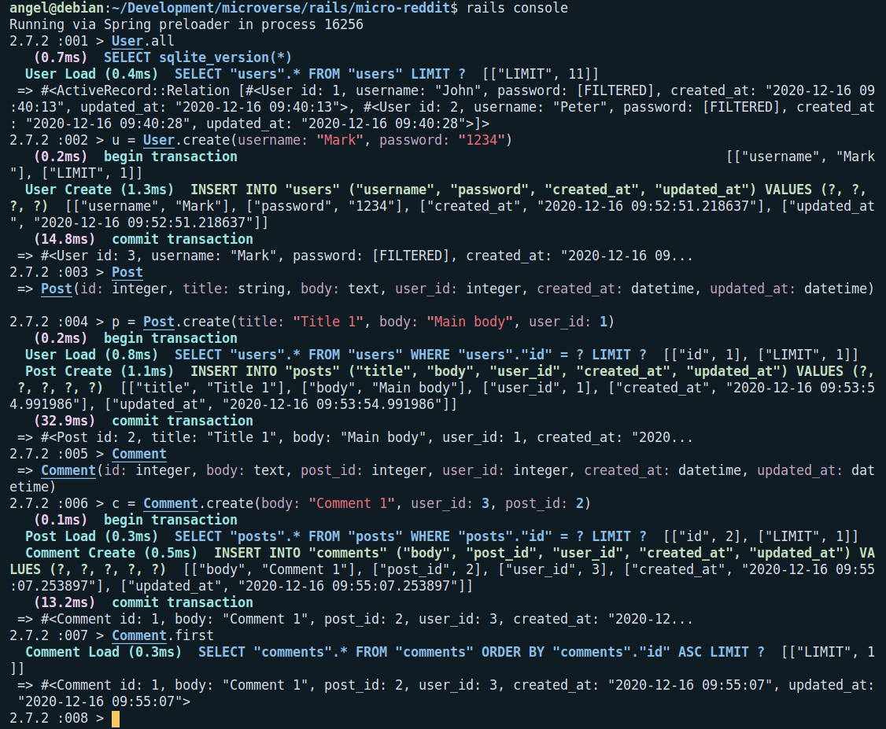

# Rails Programming

## PROJECT: BUILDING WITH ACTIVE RECORD

## Introduction

In this project we created a simple version of [Reddit](https://www.reddit.com/) following the instructions from [The Odin Project](https://www.theodinproject.com/courses/ruby-on-rails/lessons/building-with-active-record-ruby-on-rails).

We used basic concepts of Ruby on Rails including:

- Models, Views, and Controllers (MVC)
- Data Structures & Relationships
- Migrations
- RESTful design

## To install and run

- Clone the project repo from [GitHub](https://github.com/Zappat0n/micro-reddit/) using `git clone https://github.com/Zappat0n/micro-reddit/`
- Make sure [Ruby-lang](https://www.ruby-lang.org/en/) is installed
- Make sure [Bundler](https://bundler.io/) is installed
- Install the required gems. Run `bundle install`
- Install the locale database. Run `rake db:migrate`
- If you have problems with the gem versions try installing [RVM](https://rvm.io/)
- Launch a Rails Server using `rails server`
- Launch a Rails Console using `rails console`
- Now you can do basic operations with the ActiveRecords User, Comment & Post.

## Micro-reddit app

### Model

We have created a simplified model of the one used in [Reddit](https://www.reddit.com/).

There are three classes: User, Post & Comment.

#### User
  - Has two fields: username & password.
  - He can have many posts.
  - The username needs to be present and be unique.
  - The password needs to be between 4 and 12 characters long.

#### Post
  - Has three fields: title, body & user_id.
  - The user_id needs to be present.
  - The user_id is a foreign key representing the author of the post.

#### Comment
  - Has three fields: body, post_id & user_id .
  - The user_id and the post_id need to be present.
  - The user_id is a foreign key representing the author of the comment.
  - The post_id is a foreign key representing the post of the comment.

### Operations

In each class you can do the basic CRUD operations:

- all: Displays all the elements in that table. Ex: `User.all`
- first: Displays the first element in that table. Ex: `Comment.first`
- new: Creates a new element. Ex: `Post.new(title: "Main title", body: "Main body", user_id: 1)`
- create: Creates a new element and adds it to the table. Ex: `User.create(username: "Peter", password: "1234")`
- destroy: Delete an element from the table. Ex: `User.destroy(3)`

## Designed With
- Ruby
- Rails
- Git
- Gitflows
- Rubocop
- VS Code

## Contribute to this Project

Contributions, issues, and feature requests are welcome! Start by:

  - Forking the project
  - Cloning the project to your local machine
  - cd into the project directory
  - Run git checkout -b your-branch-name
  - Make your contributions
  - Push your branch up to your forked repository
  - Open a Pull Request with a detailed description of the development branch of the original project for a review

## Authors

👤 **Angel Barros**

- GitHub: [@Zappat0n](https://github.com/Zappat0n)
- LinkedIn: [LinkedIn](https://www.linkedin.com/in/angel-barros/)

👤 **Suyash Fowdar**
- Github: [@Krishnzzz](https://github.com/krishnzzz)
- LinkedIn: [Suyash Fowdar](https://www.linkedin.com/in/suyash-fowdar-22b89514a/)

## Show your support

Give a ⭐️ if you like this project!
